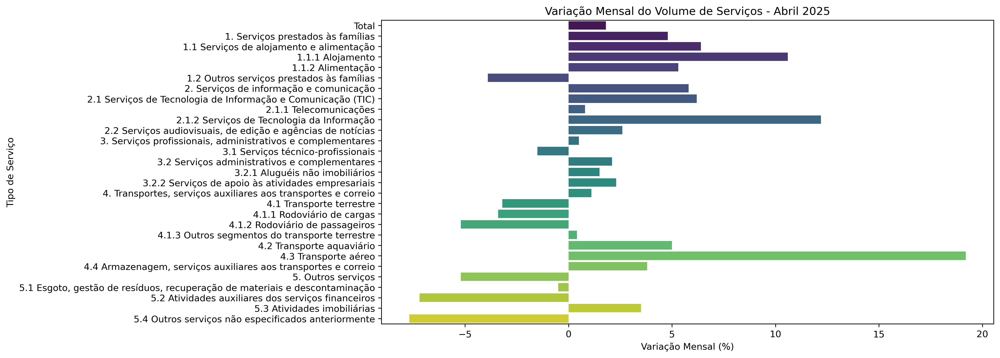
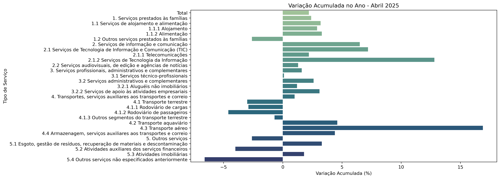
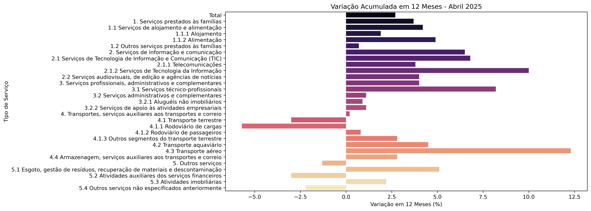

# Análise do Volume de Serviços no Brasil – Abril 2025 
Uma análise exploratória dos dados da Pesquisa Mensal de Serviços (PMS), divulgada pelo IBGE, do mês de abril de 2025.
Com o objetivo de analisar e visualizar as variações no volume de serviços por atividade econômica, com base nas seguintes métricas:

- Variação Mensal
- Variação Acumulada no Ano
- Variação Acumulada em 12 Meses

Fonte: [IBGE - Pesquisa Mensal de Serviços (PMS)](https://sidra.ibge.gov.br/)

## Gráficos

### Variação Mensal

### Variação Acumulada no Ano

### Variação Acumulada em 12 Meses

## Tecnologias

- Python 3
- pandas
- matplotlib
- seaborn
- Jupyter Notebook / VS Code

O setor **de transporte aéreo** apresentou o maior crescimento nas três métricas, enquanto **alguns serviços administrativos** registraram retração.

